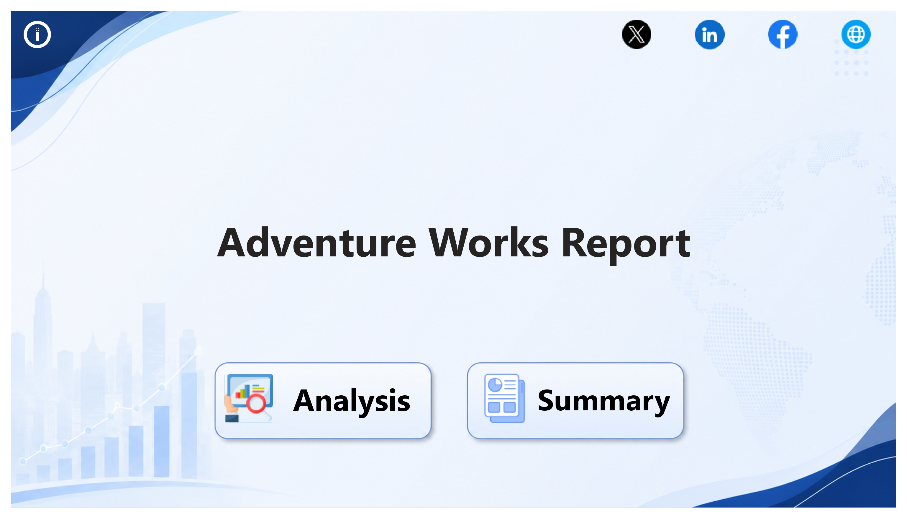
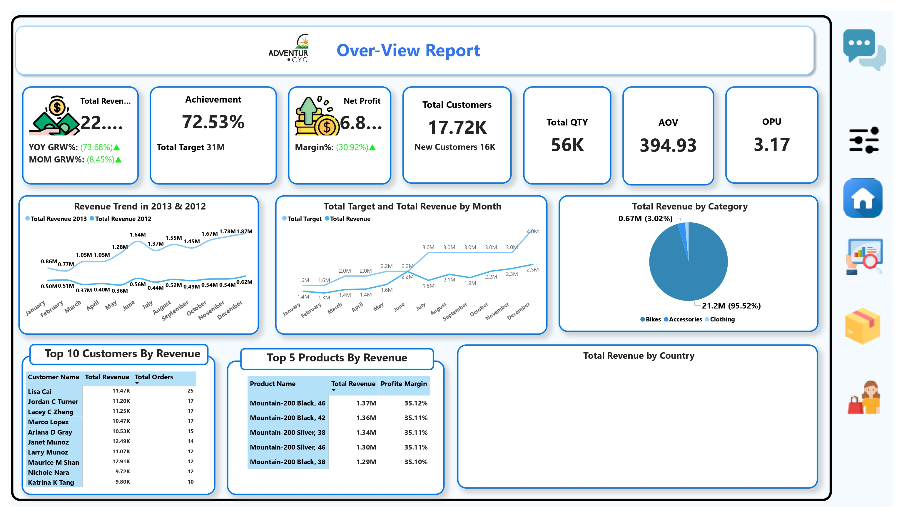
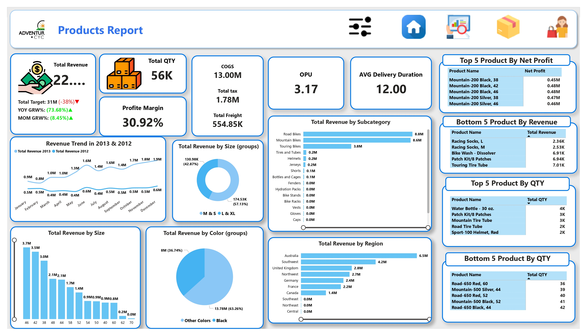
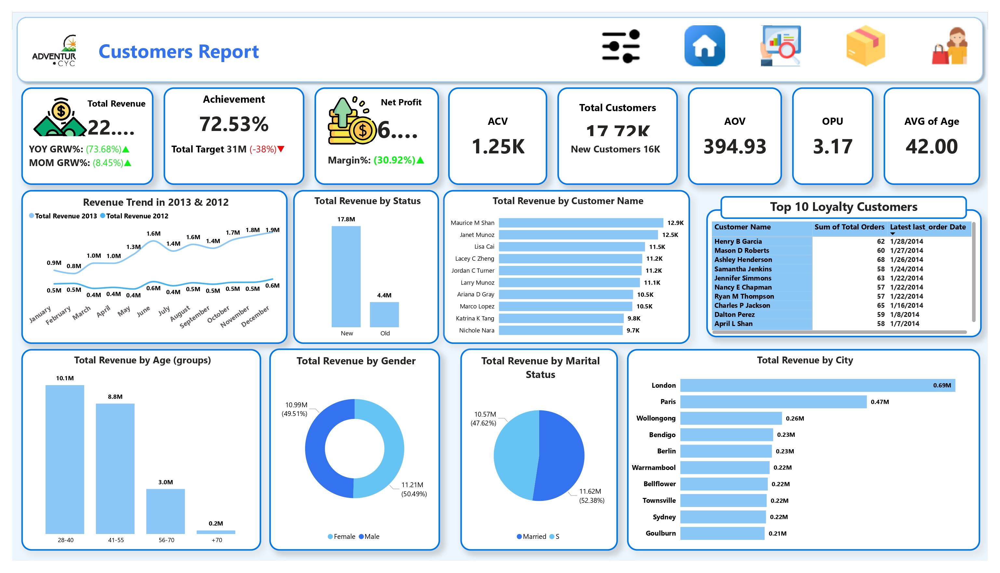
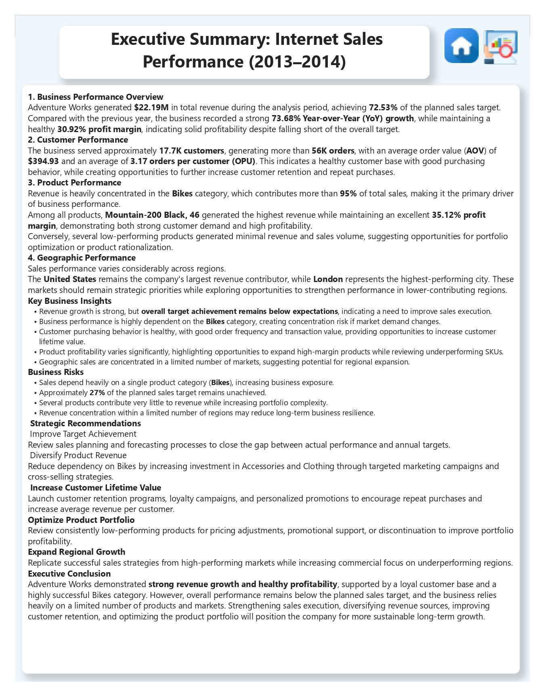

# 🚴 AdventureWorks Sales Performance Dashboard


---

# 📌 Project Overview

AdventureWorks Sales Performance Dashboard is an end-to-end **Business Intelligence** solution developed using **Power BI**, **SQL Server**, and **Excel**.

The project analyzes Internet Sales performance from multiple business perspectives, enabling decision-makers to monitor KPIs, evaluate profitability, understand customer behavior, analyze product performance, and identify opportunities for business growth through interactive dashboards.

---

# 🎯 Business Objectives

This dashboard answers key business questions such as:

- How is the business performing overall?
- Are sales targets being achieved?
- Which products generate the highest revenue and profit?
- Which customers contribute the most revenue?
- Which countries and cities drive sales?
- How healthy is customer purchasing behavior?
- What business opportunities can improve future performance?

---

# 📊 Dashboard Pages

## 🏠 Home

Navigation page providing easy access to all report sections.

---

## 📈 Executive Overview

Provides a high-level business overview including:

- Total Revenue
- Achievement %
- Net Profit
- Profit Margin
- Customer KPIs
- Revenue Trend
- Category Performance
- Geographic Performance
- Top Customers
- Top Products

---

## 📦 Product Analysis

Analyzes product performance through:

- Revenue
- Quantity Sold
- Profit Margin
- COGS
- Delivery Duration
- Top Products
- Bottom Products
- Revenue by Size
- Revenue by Color
- Revenue by Region

---

## 👥 Customer Analysis

Provides customer insights including:

- Customer Revenue
- Customer Segmentation
- Customer Demographics
- Loyalty Customers
- Revenue by Gender
- Revenue by Age
- Revenue by Marital Status
- Revenue by City

---

## 📋 Executive Summary

Summarizes the complete business analysis through:

- Business Performance
- Key Insights
- Business Risks
- Strategic Recommendations
- Executive Conclusion

---

# 📷 Dashboard Preview

| Home | Executive Overview |
|------|--------------------|
|  |  |

| Product Analysis | Customer Analysis |
|------------------|-------------------|
|  |  |

| Executive Summary |
|-------------------|
|  |

📌 **Full dashboard screenshots are available in the [`screenshots`](./screenshots) folder.**

---

# 📌 Key Performance Indicators

- Total Revenue
- Total Target
- Achievement %
- Net Profit
- Profit Margin
- Total Customers
- New Customers
- Average Order Value (AOV)
- Orders Per User (OPU)
- Average Customer Value (ACV)
- Total Quantity
- Cost of Goods Sold (COGS)

---

# 📈 Key Insights

- Generated **$22.19M** in Total Revenue.
- Achieved **72.53%** of the annual sales target.
- Recorded **73.68% Year-over-Year Growth**.
- Maintained a healthy **30.92% Profit Margin**.
- Bikes generated more than **95%** of total revenue.
- Mountain-200 product series delivered the highest revenue and profitability.
- The United States was the company's strongest market.
- London generated the highest city-level revenue.
- Customers placed an average of **3.17 orders**, indicating healthy purchasing behavior.

---

# 💡 Business Recommendations

- Improve sales forecasting to increase target achievement.
- Reduce dependency on Bikes by expanding Accessories and Clothing sales.
- Increase customer retention through loyalty programs.
- Optimize low-performing products.
- Focus commercial efforts on underperforming regions.
- Continue investing in high-margin products.

---

# ⭐ Executive Summary

AdventureWorks generated **$22.19M** in revenue while maintaining a healthy **30.92% profit margin** and achieving **72.53%** of the annual sales target.

Although revenue experienced strong year-over-year growth, the analysis identified opportunities to improve sales execution and increase target achievement. Product analysis revealed that the business depends heavily on the Bikes category, while customer analysis highlighted healthy purchasing behavior with strong repeat buying activity.

The dashboard provides actionable insights that support strategic planning, product optimization, customer retention, and sustainable business growth.

---

# 🛠️ Tools & Technologies

- Microsoft Power BI
- DAX
- Power Query
- SQL Server
- Microsoft Excel
- Data Modeling
- Star Schema
- Business Intelligence

---

# 📂 Repository Structure

```text
📦 adventureworks-sales-performance-dashboard
│
├── README.md
├── AdventureWorks_Sales_Dashboard.pbix
├── Data_Extraction_and_Preparation.sql
├── AdventureWorks_SalesBudget.xlsx
│
├── screenshots/
│   ├── 01_home.jpg
│   ├── 02_overview.jpg
│   ├── 03_products.jpg
│   ├── 04_customers.jpg
│   └── 05_summary.jpg
```

---

# 📌 Skills Demonstrated

- Business Intelligence
- Data Analysis
- SQL
- Power Query
- DAX
- Data Modeling
- Star Schema
- Dashboard Design
- KPI Development
- Business Analysis
- Product Analytics
- Customer Analytics
- Data Storytelling

---

# 🚀 Business Value

This dashboard helps decision-makers to:

- Monitor overall business performance.
- Evaluate sales target achievement.
- Measure profitability.
- Analyze customer purchasing behavior.
- Identify high-performing products.
- Compare geographic sales performance.
- Support strategic business decisions through data-driven insights.

---

# 👨‍💻 Author

**Ahmed Gomaa**

**Data Analyst**

### Skills

- Power BI
- SQL
- Excel
- DAX
- Power Query
- Data Modeling
- Business Intelligence

